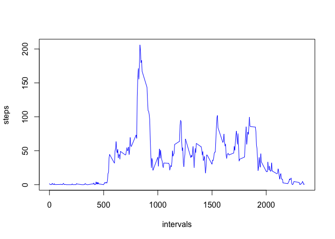
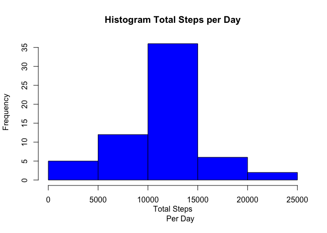
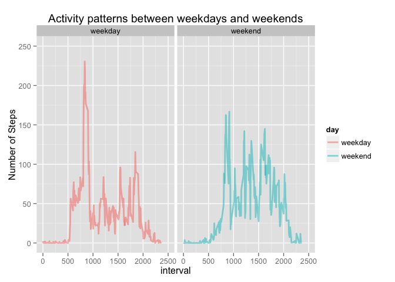

# Reproducible Research: Peer Assessment 1


## Loading and preprocessing the data

```r
activitydata <- read.csv("activity.csv")
data <- activitydata[complete.cases(activitydata),]
```

## What is mean total number of steps taken per day?

```r
stepsPerDay <-aggregate(data$steps, by=list(data$date), FUN=sum)
hist(stepsPerDay$x, main="Histogram of Steps per day", xlab="Steps")
```

 

```r
meanStepsPerDay <- mean(stepsPerDay$x)
medianStepsPerDay <- median(stepsPerDay$x)
```
### The mean total number of steps taken per day is 1.0766189\times 10^{4}
### The corresponding median for the steps taken per day is 10765

## What is the average daily activity pattern?

```r
meanStepsInterval <- aggregate(data$steps, by=list(data$interval), FUN=mean)

plot(meanStepsInterval$Group.1, meanStepsInterval$x, type="l",xlab="intervals", ylab="steps", col="blue")
```

 

```r
result <- meanStepsInterval[meanStepsInterval$x==max(meanStepsInterval$x),]$Group.1
```
### The interval, on average across all days with the maximum number of steps is 835

## Imputing missing values

```r
dataNA <-activitydata[!complete.cases(activitydata),]
nrowsNA <- nrow(dataNA)
```
### The number of missing values in the dataset is 2304
#### The Stragety used to fill the NAs values is to use the mean fot that 5-interval over all days.

```r
activitydata2 <- activitydata
for (i in 1:length(meanStepsInterval$Group.1)) {

    len  <- length(activitydata2[(is.na(activitydata2$steps) & activitydata2$interval == 
    meanStepsInterval$Group.1[i]),]$steps)

    activitydata2[(is.na(activitydata2$steps) & activitydata2$interval == 
    meanStepsInterval$Group.1[i]),]$steps  <- rep(meanStepsInterval$x[i],len)
  }
  
  table2  <- aggregate(activitydata2$steps, by = list(date = activitydata2$date), FUN = sum)

  hist(table2$x, main = "Histogram Total Steps per Day", xlab = "Total Steps
       Per Day", col = 'blue')
```

 

```r
meanSteps2  <- mean(table2$x)
meanSteps2
```

```
## [1] 10766.19
```

```r
medianSteps2  <- median(table2$x)
medianSteps2
```

```
## [1] 10766.19
```
### These values differ from the estimates from the first part of the assignment. Now mean and median are the same. Imputing missing data on the estimates of the total daily number of steps introduce less bias.

## Are there differences in activity patterns between weekdays and weekends?

```r
  # Create a new factor variable in the dataset with two levels – “weekday” and “weekend”
  # indicating whether a given date is a weekday or weekend day.
  dataext  <-  data.frame(day = weekdays(as.Date(activitydata2$date)), activitydata2)
  dataext <- transform(dataext , day = ifelse((day == "Saturday" | day == "Sunday"), 
                       "weekend", "weekday"))
  dataext  <- transform(dataext, day = as.factor(day))

  # Compute the average of total number steps per interval per weekend or weekday
  table3  <- aggregate(dataext$steps, by = list(interval = dataext$interval, 
                      day = dataext$day), FUN = mean)

  # Make de plot
  library("ggplot2")
  g <- ggplot(table3, aes(interval, x))
  g <- g + geom_line(aes(color = day), size = 1, alpha = 1/2)
  g <- g + ggtitle("Activity patterns between weekdays and weekends")
  g <- g + ylab("Number of Steps") + ylim(c(0,250)) + xlim(c(0,2500))
  g <- g + facet_grid(. ~ day)
  g
```

 


### Differences in activity patterns between weekdays and weekends shows more activity on the intervals from 500 to 1000 during weekdays.

### End of assignment
